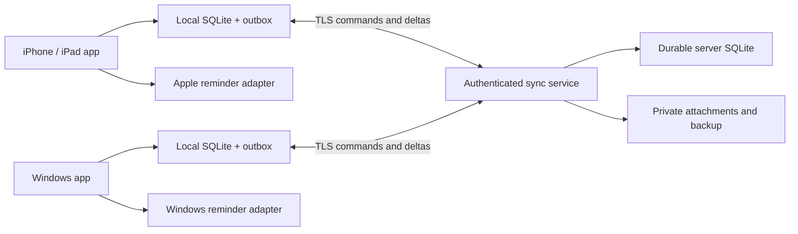

# Platform, automatic sync and cost decisions

Phase 2 architecture proposal • researched 2026-10-04. Automatic sync is confirmed by the owner; framework and hosting selection await review. No services have been purchased or deployed by this workstream.

## Client alternatives

| Approach | Existing work reused | iPhone/iPad and Windows | Offline/native reminders | Cost and main tradeoff |
|---|---|---|---|---|
| **Flutter app + embedded SQLite + small sync service — recommended proposal** | Research, information design, test cases and visual ideas; current React UI is not portable source | One primary Dart UI/domain codebase with platform adapters | Local DB and native notification adapters; alarm support still requires OS-specific work | More initial UI rebuilding; simpler long-term primary client stack for the stated targets |
| React static client + Capacitor for Apple + Tauri for Windows + sync service | More React layout reuse; current state/API still needs redesign | Two shell toolchains and shared TypeScript UI | Native adapters per shell; unsupported web behavior cannot be assumed native | Lower immediate layout rewrite, higher adapter/test matrix |
| Responsive Next.js/PWA + hosted sync | Most layout reuse | Browser-accessible on target devices; store packaging separate | Offline storage/service-worker design needed; web push does not equal native alarm semantics | Fastest browser iteration, weaker fit for the requested alarm/store experience |

The recommendation is an engineering judgment from the target devices, offline persistence and native-reminder needs, not a measured benchmark. Flutter documents Windows desktop support and platform plugins. Its iOS build route needs Xcode on macOS. The user's available Mac/build route is still unknown. [Flutter desktop](https://docs.flutter.dev/platform-integration/desktop), [Flutter iOS setup](https://docs.flutter.dev/platform-integration/ios/setup)

The hybrid option remains viable, but exporting the current Next app does not retain its dynamic POST API: those features require a server. Capacitor and Tauri also bring their own native build prerequisites. [Next static exports](https://nextjs.org/docs/app/guides/static-exports), [Capacitor environment](https://capacitorjs.com/docs/getting-started/environment-setup), [Tauri prerequisites](https://v2.tauri.app/start/prerequisites/)

Do not erase or relocate the existing source as part of adopting this proposal. Keep it as a separately assessed prototype. If approved, create the production client under apps/stoic_body and server under services/sync. Do not migrate personal/sample records silently. Refresh dependency versions and license/support checks immediately before implementation, then pin a lockfile; research does not authorize installation.

## Proposed production structure

App modules: onboarding/profile; goals/calendar; completion/XP; training; nutrition; learning/coaching; measurements; imports; settings. Pure domain rules do not depend on UI, AI or network. Repository transactions and command IDs govern all changes. Native services own storage keys, file access and notifications. The Node/TypeScript server enforces ownership, revisions and accepted XP rules and uses durable local storage. Shared language-neutral JSON fixtures test equivalent client/server decisions.

Local storage saves first; sync reconciles automatically. Server SQLite is accessed only through authenticated application APIs, never shared directly between devices. SQLite is suitable for an initial bounded service; one-writer contention and measured workload determine its scale limits. Do not claim a user capacity without a representative load test. [SQLite appropriate uses](https://www.sqlite.org/whentouse.html)

## Hosting choices and current constraint

Current workspace rule: zero paid services and no external database accounts. The user requires automatic sync at launch. These can coexist through an owner-operated always-on service, but hardware, power, network access, TLS, monitoring and backup are real operational requirements. A Windows PC that sleeps is not an always-available commercial service. Never expose the existing ULTRON runtime or its administrative tools as this backend.

| Route | Feasible under current rule? | What must be resolved |
|---|---|---|
| Dedicated owner-controlled host, Node + SQLite on durable local disk | Yes if suitable existing hardware/network are available | Reachability, TLS/domain route, uptime responsibility, off-device backups and secure maintenance |
| Paid host with persistent disk and SQLite | Requires a budget change | Approved provider/region/price, backup costs, monitoring and operating responsibility |
| Managed database/auth service | Conflicts with current external-account rule unless explicitly changed | Account/provider approval, costs, offline sync behavior, data region and customer isolation |

Hosting preference has been asked. Until answered, the proposed contract is provider-independent and the default infrastructure constraint remains. This is an unresolved launch prerequisite, not a reason to omit automatic sync. No free-tier service is assumed to offer permanent free production capacity.

## Notification capability contract

Use local OS scheduling for accepted reminders, not JavaScript timers or a database row alone. Status distinguishes disabled, permission denied, registered with OS, registration failed and observed during a device test. The product must not fabricate a delivered acknowledgement when an OS offers none.

On iOS/iPadOS 26+, evaluate AlarmKit for explicitly opted-in alarms. It requires authorization; ordinary notifications on other supported versions retain their own limitations. Provide ordinary reminders and a capability explanation when alarms are unavailable. [Apple AlarmKit](https://developer.apple.com/videos/play/wwdc2025/230/)

On Windows, use the appropriate packaged-app notification integration. Microsoft's scheduled notification guidance describes a five-minute delivery window and dropping events when the PC remains off beyond it. Do not promise waking a powered-off PC; show missed reminders on next open. [Windows scheduled notifications](https://learn.microsoft.com/en-us/windows/apps/develop/notifications/app-notifications/app-notifications-scheduled)

Rescheduling cancels/replaces the occurrence's registered reminder idempotently. Device preference controls where it rings. Locally scheduled reminders survive app closure only to the extent verified on the actual OS/device. Remote changes arriving while an app is suspended may not update that device until OS background work or the next foreground sync; disclose this limitation. If guaranteed immediate remote alarm updates are required, that capability needs an additional validated architecture, not a claim based on automatic sync alone.

Device matrix: iPhone and iPad on proposed minimum OS and current OS; Windows 11 packaged build; permissions allowed/denied/revoked; app foreground/background/terminated; device locked, offline, sleeping/rebooted; timezone/DST changes; cross-device edits; completion cancellation. Android notification behavior is a later separate gate if Android timing remains later.

## AI and integrations

The first usable core uses deterministic rules and curated content. Optional AI can draft goal breakdowns, explanations or extraction candidates, but cannot directly write accepted schedules, grant XP, diagnose physique, publish or contact anyone. Any external provider gets an explicit data-preview consent and visible cost boundary. A self-hosted model is optional and not assumed reachable from a phone. No automatic paid fallback.

Calendar, wearable and health-platform integrations remain later adapters with scoped permission, source IDs, sync direction, deduplication, disconnect and conflict rules. Account sync between Stoic Body devices is launch scope and is separate from those optional integrations.

## Costs and commercial gates

No final price or operating budget is approved. Cost ownership must include server power/hosting, backups/storage, domain/TLS route, support, content review, developer hardware, signing/accounts and store fees/commissions. Earlier fee research is in the [platform review](../research/platform-and-launch.md); recheck actual account/region terms before enrollment. Free tooling does not make commercial operation free.

Launch scope assumes adult personal accounts, each isolated; no coach/client multi-tenancy or child accounts. Choose paid/free boundaries in Phase 6B after pilot usability evidence. Purchase adapters are store-specific and must test restoration/refunds; never encode permanent founder access for every installed user. Marketing uses synthetic records and substantiated claims. Approval of this specification does not enroll accounts, accept paid terms or publish releases.

## 2026-10-04 host clarification
The user chose their desktop and explicitly said it need not always be on. Treat it as intermittently available: clients keep their own data and outboxes; sync retries while the app is active/OS permits background work; show last successful sync and pending changes. Neither device power-off nor app termination is a guaranteed sync window. Preserve existing private services and require actual two-device offline/reconnect evidence. The account-recovery checkpoint does not implement this adapter.
